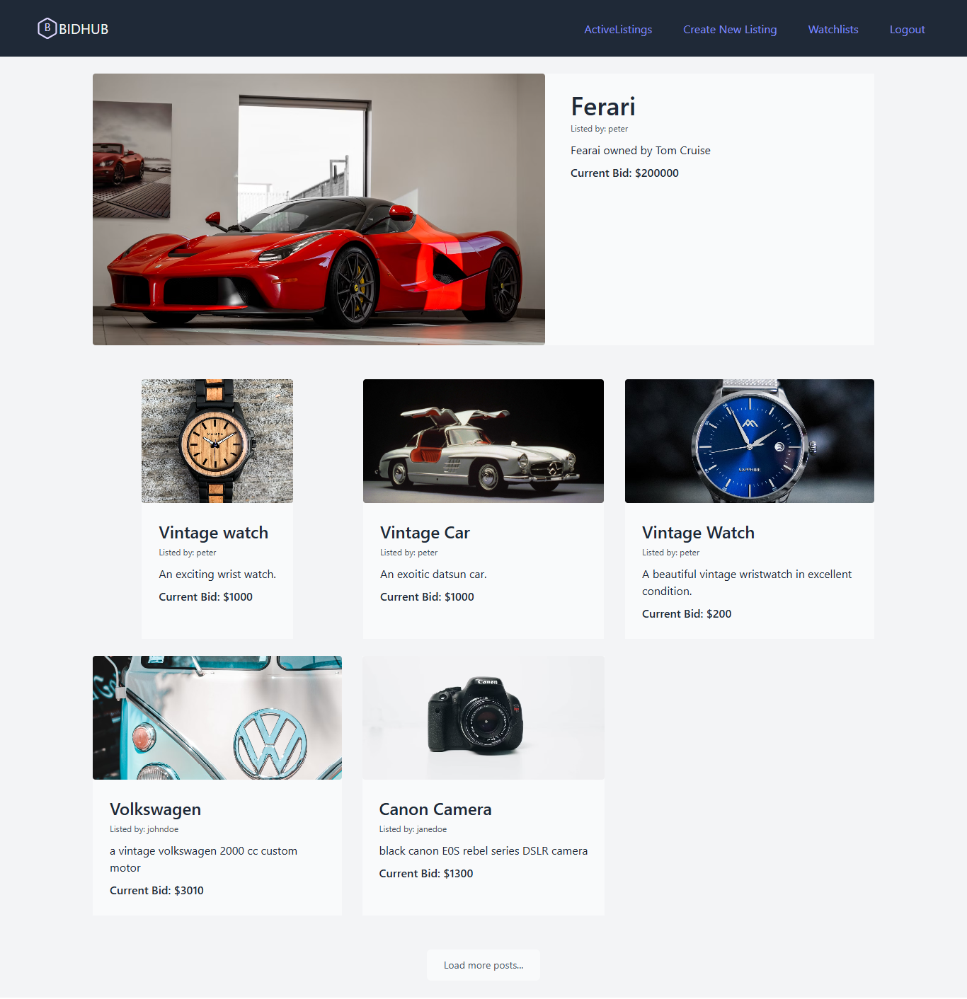

# Project Title: Henoker Auction House - Modern Stack Edition

An eBay-like e-commerce auction site built with Django/PostgreSQL backend and React frontend. Users can post auction listings, place bids, comment on listings, and manage watchlists.

## Key Architecture Changes

- **Backend**: Django REST Framework with PostgreSQL database
- **Frontend**: React.js with modern UI components
- **API**: RESTful interface between frontend and backend
- **State Management**: Redux for managing application state

## Screenshots



## About the Project

This project has been upgraded from a Django-only implementation to a modern full-stack architecture. Key improvements include:

### Backend (Django + PostgreSQL)

- RESTful API endpoints for all operations
- Enhanced database models with PostgreSQL-specific features
- JWT authentication for secure API access
- Optimized queries for better performance
- Django admin interface for content management

### Frontend (React)

- Single Page Application (SPA) architecture
- Responsive UI with modern design
- Client-side routing for seamless navigation
- Real-time updates for bids and comments
- Interactive watchlist management

## Features

- **User Authentication**: Secure login/registration with JWT
- **Listing Management**: Create, view, update, and close auctions
- **Bidding System**: Real-time bid updates with validation
- **Watchlist**: Personalized collection of favorite items
- **Comments**: Interactive discussion on listings
- **Categories**: Browse listings by category
- **Admin Dashboard**: Full CRUD capabilities via Django admin

## Technology Stack

### Backend

- Python 3.10.2
- Django 4.2.7
- Django REST Framework
- PostgreSQL
- JWT Authentication
- Django CORS Headers

### Frontend

- React.js
- React Router
- Axios for API calls
- @reduxjs/toolkit for (state management)
- Tailwind CSS
-

## Getting Started

### Prerequisites

- Node.js (v14+)
- Python 3.8+
- PostgreSQL (v12+)
- npm or yarn

### Installation

1. **Clone the repository**

   ```bash
   git clone https://github.com/Henoker/BidHub.git

   ```

2. **Backend Setup**

- cd backend
- python -m venv venv
- venv\Scripts\activate
- pip install -r requirements.txt

# Set up PostgreSQL database and update settings.py

- python manage.py migrate
- python manage.py createsuperuser
- python manage.py runserver

3. **Frontend Setup**

- cd frontend/client
- npm install
- npm run start

4. **Environment Variables**

- Create .env files for both backend and frontend with appropriate configuration (database URL, API endpoints, etc.)

## LICENSE

- MIT License

## Contact

- Henock Beyene Testfatsion - [hennybany@gmail.com](mailto:hennybany@gmail.com)
- Project link: https://github.com/Henoker/BidHub

## Contributing

- Henock Beyene Tesfatsion - [hennybany@gmail.com](mailto:hennybany@gmail.com)

## Love my effort?

<a href='https://www.linkedin.com/in/henock-beyene-tesfatsion-921ba54b/' target='_blank'>
